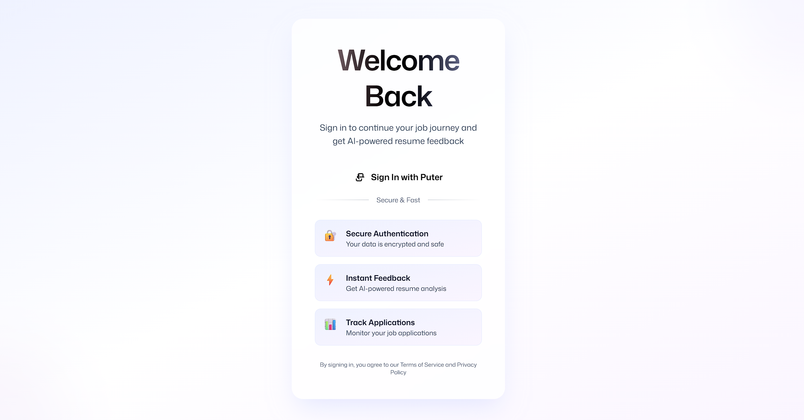
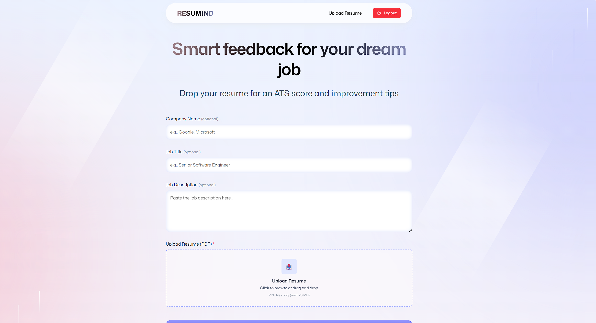
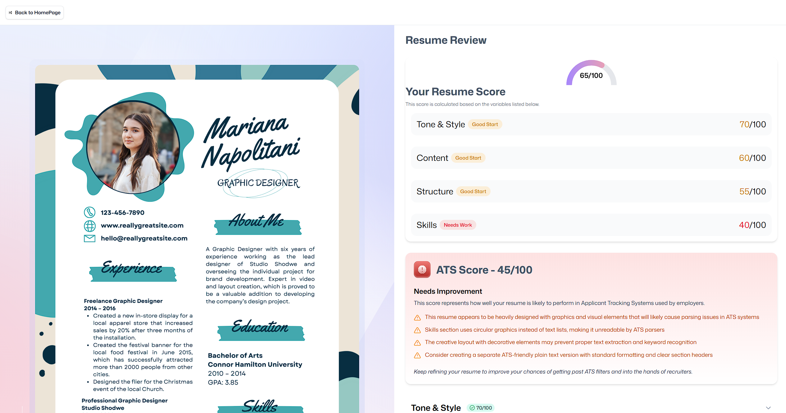

# AI-Powered Application Tracking System

Live Demo: [https://ai-powered-application-tracking-system.onrender.com/](https://ai-powered-application-tracking-system.onrender.com/)
*Deployed using **Render***

---

## 🚀 Project Overview

AI-Powered Application Tracking System is a modern web application built using React + TypeScript, designed to simplify how users track and manage job applications.
The UI is enhanced with smooth animations, clean design, and a fast development environment powered by the latest tools and libraries.

---

## 🧩 Key Features

* Responsive, modern UI with **React** + **Tailwind CSS**
* Smooth page and component animations using **GSAP**
* Global state management with **Zustand**
* Routing and navigation powered by **React Router v7**
* Fully typed with **TypeScript**
* Lightning-fast builds and dev server using **Vite**
* Clean and structured code for long-term scalability
* Hosted and deployed via **Render**

---

## 🛠️ Getting Started (Local Development)

### 1. Clone the repository

```
git clone https://github.com/yashuyouwaraj/AI-Powered-Application-Tracking-System.git
cd AI-Powered-Application-Tracking-System
```

### 2. Install dependencies

```
npm install
```

### 3. Start development server

```
npm run dev
```

Default Vite URL:
`http://localhost:5173`

### 4. Build for production

```
npm run build
```

### 5. Start production server (SSR build if used)

```
npm start
```

---

## 📦 Project Structure

```
/app                      → Main application components, routes, and pages
/constants                → Shared constants and configuration
/public                   → Static assets (icons, images, etc.)
/types                    → TypeScript types and interfaces
react-router.config.ts    → React Router route definitions
vite.config.ts            → Vite configuration with Tailwind, Router, TS paths plugins
package.json
tsconfig.json
README.md
```

---

## 🌐 Deployment

This project is deployed using **Render**.
Render automatically builds and serves both client and server bundles (React Router SSR).

Live App:
[https://ai-powered-application-tracking-system.onrender.com/](https://ai-powered-application-tracking-system.onrender.com/)

---

## ✅ Technologies Used

* **React 19**
* **TypeScript**
* **Vite**
* **Tailwind CSS**
* **GSAP (GreenSock)**
* **Zustand**
* **React Router v7**
* **Puter.js**
* **Node.js + React Router Server** (for SSR if configured)
* **Render** (Hosting & Deployment)
* **Git + GitHub** (Version Control)

---

## 🔍 Future Enhancements




* User authentication & profile system
* Export job application data to CSV/PDF
* AI-based application success prediction
* Improved analytics dashboard
* Mobile-first UI refinements
* Automated tests (Jest, React Testing Library)
* CI/CD (GitHub Actions)



---

## 🤝 Contributing

Contributions are always welcome!

Steps:

1. Fork the repository
2. Create a new branch (`git checkout -b feature/NewFeature`)
3. Commit changes (`git commit -m "Add NewFeature"`)
4. Push branch (`git push origin feature/NewFeature`)
5. Open a pull request

---

## 📄 License

MIT License
© 2025 Yashu Youwaraj

---

## ✉️ Contact

For questions, suggestions, or issues, feel free to open an issue on GitHub.

---

If you want screenshots, badges, or a more stylish README.md version, I can generate that too!
